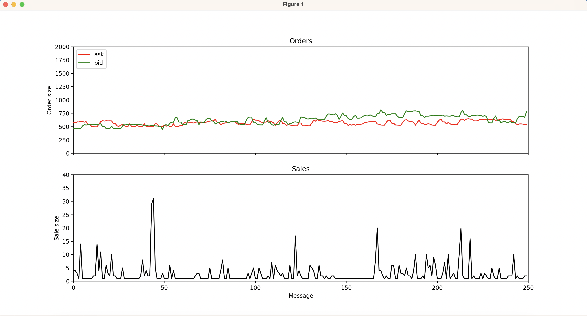
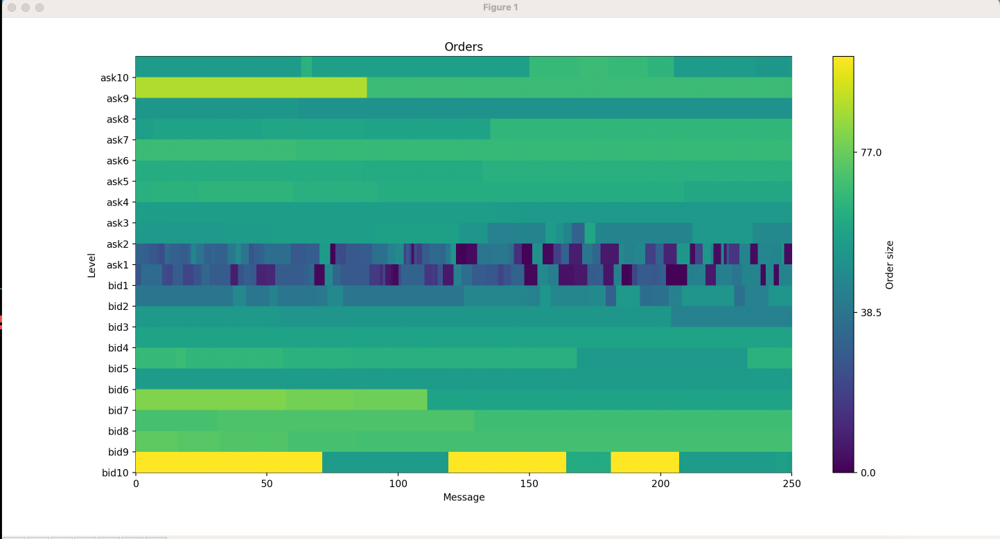

# About

Some utility tools for ibkr TWS api

# Requirements

- Python 3.9
- pipenv
- IBKR TWS API (https://interactivebrokers.github.io)

# Installation

- Move ibkr api under the `IBJts` directory
- `pipenv install`

## Spoof detector

Visualizes the bid and ask orders and sales in single window with different type of charts. Run `python spoof_detector/spoof_detector.py --help`. You will see all the options

## Stock picker

Downloads the symbol with the given query and saves them in TWS watchlist format. It is still under development

## Algos

Executes trade according to macroeconomic data releases. E.g non farm payroll, jobless claims... It is still under development
