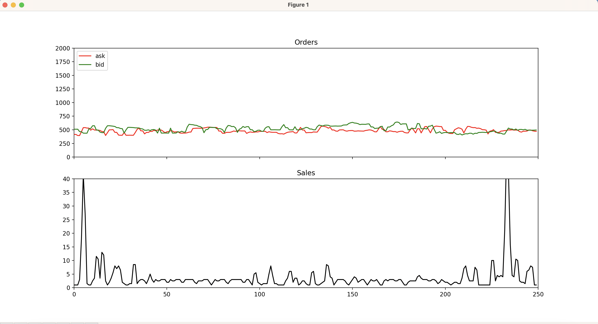

# About

Some utility tools for ibkr tws api

# Requirements

- Python 3.9
- pipenv
- IBKR TWS API (https://interactivebrokers.github.io)

# Installation

- Move ibkr api under the `IBJts` directory
- `pipenv install`

# Spoof detector

Visualizes the bid and ask orders and sales in single window

# Fin wiz fetcher

Downloads the symbol with the given query and saves them in TWS watchlist format
